<a href="https://opensource.org/licenses/Apache-2.0" target="_blank"></a>
<a href="https://github.com/Abhimanyu14/finance-manager/stargazers" target="_blank"></a>
<a href="https://github.com/Abhimanyu14/finance-manager/fork" target="_blank"></a>


# Overview

A finance manager app to track and analyse income, expenses and investments.

# Features

1. Transactions - Create, Read, Update and Delete (CRUD)
2. Accounts - CRUD
3. Categories - CRUD
4. TransactionFor - CRUD
5. Overview
6. Analysis
7. Export to JSON
8. Import from JSON
9. Reminder notifications

# Tech Stack

| Programming Language    | Kotlin                         |
| ----------------------- | ------------------------------ |
| Build tool              | Gradle                         |
| UI Toolkit              | Jetpack Compose                |
| Database                | SQLite Database using Room ORM |
| Preferences             | Jetpack Data Store             |
| Dependency Injection    | Hilt                           |
| Networking              | Retrofit                       |
| Unit Testing            | JUnit, Fake and Turbine        |
| UI Testing              | Compose tests                  |
| Design System           | Material 3                     |
| Serialization           | Kotlin serialization           |
| Architecture components | Lifecycle, ViewModel           |
| Async                   | Coroutines and Flows           |
| Kotlin Processor        | Kapt & KSP                     |

# Architecture

- MVVM
- Single Activity architecture with Compose Navigation
- Multi modular - split by features
- Clean code principles

## Modularization

- The below graph can be rendered using Mermaid.

### Module Dependency Graph

```mermaid
flowchart TB

  subgraph app
  A(:app)
  A1(:app-ui-catalog)
  end

  subgraph chart
  C(:chart)
  end

  subgraph core
  CA(:core:alarmkit)
  CA1(:core:alarmkitimpl)
  CA2(:core:appkit)
  CB(:core:boot)
  CC(:core:common)
  CD(:core:data)
  CD1(:core:database)
  CD2(:core:datastore)
  CD3(:core:designsystem)
  CL(:core:logger)
  CM(:core:model)
  CN(:core:navigation)
  CN1(:core:network)
  CN2(:core:notificationkit)
  CN3(:core:notificationkitimpl)
  CT(:core:testing)
  CT1(:core:time)
  CU(:core:ui)
  end

  subgraph features
  FA(:feature:accounts)
  FA1(:feature:analysis)
  FC(:feature:categories)
  FH(:feature:home)
  FS(:feature:settings)
  FT(:feature:transactionfor)
  FT1(:feature:transactions)
  end

  A --> CA
  A --> CA
  A --> CA1
  A --> CA2
  A --> CB
  A --> CC
  A --> CD
  A --> CD1
  A --> CD2
  A --> CD3
  A --> CL
  A --> CN
  A --> CN2
  A --> CN3
  A --> CT1
  A --> CU
  A --> FA
  A --> FA1
  A --> FC
  A --> FH
  A --> FS
  A --> FT
  A --> FT1

  C --> CD3

  CD --> CC
  CD --> CD1
  CD --> CD2
  CD --> CM
  CD --> CN

  CD3 --> CC

  CA1 --> CA
  CA1 --> CB
  CA1 --> CC
  CA1 --> CD
  CA1 --> CL
  CA1 --> CM
  CA1 --> CN
  CA1 --> CT

  CN --> CC

  CN1 --> CC

  CN2 --> CC

  CN3 --> CA2
  CN3 --> CL
  CN3 --> CN2

  CT --> CC
  CT --> CL

  CT1 --> CA
  CT1 --> CC
  CT1 --> CD

  CU --> CC
  CU --> CN
  CU --> CM
  CU --> CD
  CU --> CD
  CU --> C

  FA --> CC
  FA --> CD
  FA --> CD1
  FA --> CN
  FA --> CL
  FA --> CM
  FA --> CU

  FA1 --> CC
  FA1 --> CD
  FA1 --> CD1
  FA1 --> CL
  FA1 --> CM
  FA1 --> CN
  FA1 --> CU

  FC --> CC
  FC --> CD
  FC --> CD1
  FC --> CL
  FC --> CM
  FC --> CN
  FC --> CU

  FH --> CC
  FH --> CD
  FH --> CD1
  FH --> CL
  FH --> CM
  FH --> CN
  FH --> CU

  FS --> CA
  FS --> CC
  FS --> CD
  FS --> CD1
  FS --> CL
  FS --> CM
  FS --> CN
  FS --> CU

  FT --> CC
  FT --> CD
  FT --> CD1
  FT --> CL
  FT --> CM
  FT --> CN
  FT --> CU

  FT1 --> CC
  FT1 --> CD
  FT1 --> CD1
  FT1 --> CL
  FT1 --> CM
  FT1 --> CN
  FT1 --> CU
```



At Top level, we can find two app modules namely `app` and `app-ui-catalog`.

- `app` - The main module for the app
- `app-ui-catalog` - UI catalog app to view design system components in a standalone app.

All features are inside a top level package `feature`.  
And the core parts of the app are inside the module named `core`.

`chart` - This module is used to render charts in the app like this,


### Core

1. `common` - For basic functionalities commonly used throughout the app  
   Examples
   - App Constants
   - Coroutine dispatcher providers
   - JSON reader and writer
   - String decoder
2. `database` - For all database operations - Dao, DataSource, Database migrations, etc.
3. `datastore` - For fetching and storing data from & to preferences in data store
4. `data` - For combining data from various data sources like datastore, database, local files, etc and expose repositiry and use-case for feature module usage.
5. `designsystem` - For theming using colors, shapes and typography.  
   Also has customized atomic UI components - `MyText`, `MyTab`, `MyLinearProgressIndicator`, etc.
6. `ui` - Contains higher level UI components built using custom atomic component and Material 3 components - `SelectAccountBottomSheet`, `OverviewCard`, `MyEmojiCircle`, etc.
7. `logger` - For logging in debug builds
8. `model` - Model classes and serializers
9. `navigation` - NavigationManger is used to control navigation from ViewModels.
10. `network` - WIP
11. `testing` - Test Runner, Dispatcher Rule and other testing helper methods.

### Features

1. `analysis`
2. `accounts`
3. `categories`
4. `home`
5. `settings`
6. `transactionfor`
7. `transactions`

# Commands

## Gradle Commands

1. To build the project

```
./gradlew :app:assembleDebug
```

2. To clean and build the project

```
./gradlew clean :app:assembleDebug
```

3. To run all the unit tests

```
./gradlew test
./gradlew testDebugUnitTest
```

4. To run the lint checks

```
./gradlew lint
```

5. To run all the android UI tests

```

```

6. To generate Kover Unit test coverage HTML Report

```
./gradlew koverMergedHtmlReport
```

## Scrcpy commands

1. To start screen mirroring for physical devices

```
scrcpy -m1024
```

# Backlog

Backlog of feature and changes in queue to be implemented can be found [here](https://github.com/Abhimanyu14/finance-manager/blob/main/BACKLOG.md)

# Database

### Tables

1. Transactions
2. Sources
3. Categories
4. TransactionFor

# Issues

Please do create new issues if there are any bugs or feature requests. </br>
You can also directly reach out to me via [LinkedIn](https://www.linkedin.com/in/abhimanyu-n/)

## Find this repository useful? ♥️

Support it by joining **[stargazers](https://github.com/Abhimanyu14/finance-manager/stargazers)** for this repository. 🌟  
Also **[follow me](https://github.com/Abhimanyu14)** for my next creations! 🤗

# License

```
Copyright 2024 Abhimanyu

Licensed under the Apache License, Version 2.0 (the "License");
you may not use this file except in compliance with the License.
You may obtain a copy of the License at

       http://www.apache.org/licenses/LICENSE-2.0

Unless required by applicable law or agreed to in writing, software
distributed under the License is distributed on an "AS IS" BASIS,
WITHOUT WARRANTIES OR CONDITIONS OF ANY KIND, either express or implied.
See the License for the specific language governing permissions and
limitations under the License.
```
