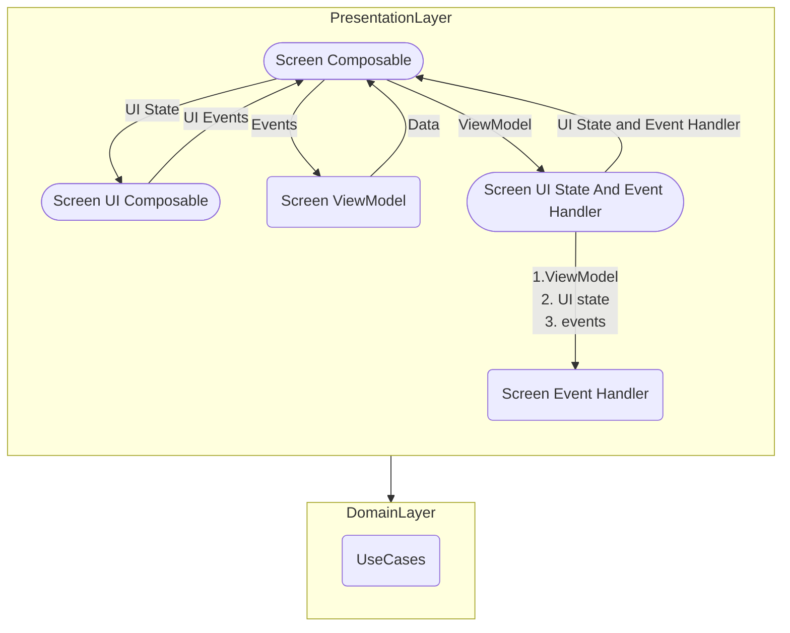

# Architecture

## Legend

1. Composable

   ```mermaid

   flowchart TB
   CO([Composable])

   ```

2. Class

   ```mermaid
   flowchart TB
   C(Class)

   ```

## Architecture Diagram



## Details

1. Screen UI Composable

    - Stateless Composable to render UI
    - Can be tested using Compose testing

2. Screen ViewModel

    - Data Holder
    - Can be tested using unit testing

3. Screen Composable

    - Logic placed here can not be tested

4. Screen UI State And Events

    - Logic placed here can not be tested
